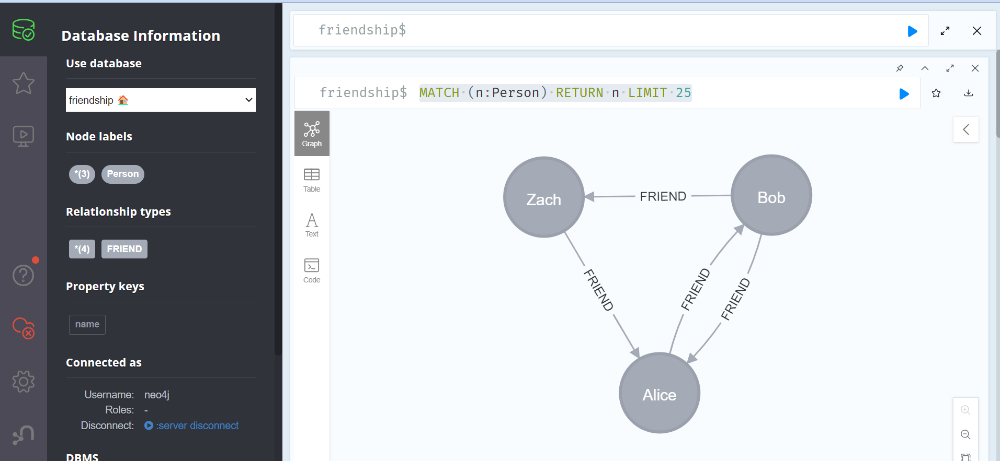

# Initialisation aux requetes CYPHER
### Creer sa premiere base
#### Note important
La version community contient certaines limitations sur lesquelles nous reviendrons .
Pour l'instant noter que la commande create database ne marche que sur la version entreprise de neo4j.
#### Version entreprise 
```
create database <database name>
Exemple
 create database friendship
```
#### Version community
Pour contourner nous allons modifier le fichier neo4j.conf 
1. Aller neo4j-community-5.19.0\conf
2. Ouvrir le fichier neo4j.conf
3. Decommenter et modifier la ligne  #initial.dbms.default_database=neo4j
   comme initial.dbms.default_database=friendship
4. Faire .\neo4j.bat console
Explications :
Par défaut neo4j creer une base appelée neo4j lors de la premiere installation
D'où la ligne initial.dbms.default_database=neo4j

#### utiliser une base 
```
use  <database name>
Exemple
    use friendship
```

#### Alimenter sa base avec des données
NB Nous allons utiliser le modele de l'exemple du petit reseau social du cours
```
Requetes pour creer les Nodes Person et les relations FRIEND
Ouvrir http://localhost:7474/browser/ et jouer les requetes suivantes 
    CREATE (alice:Person {name: 'Alice'})
    CREATE (bob:Person {name: 'Bob'})
    CREATE (zach:Person {name: 'Zach'})
    CREATE (alice)-[:FRIEND]->(bob)
    CREATE (bob)-[:FRIEND]->(alice)
    CREATE (bob)-[:FRIEND]->(zach)
    CREATE (zach)-[:FRIEND]->(alice)
```
#### Visualisation des données
1. La requete MATCH
    ```
    Exemple
        MATCH (n:Person) RETURN n LIMIT 25
    ```

2. Répondre à la question Qui sont les amis de Bob?
      ```
           MATCH (p:Person{name:'Bob'})-[r:FRIEND]->(amis:Person) RETURN amis
     ```
   
Comparer le resultat obtenu avec cette requete sql :
```
    SELECT p1.Person
    FROM Person p1 JOIN PersonFriend
     ON PersonFriend.PersonID = p1.ID
    JOIN Person p2
    ON PersonFriend.FriendID = p2.ID
    WHERE p2.Person = 'Bob'
```