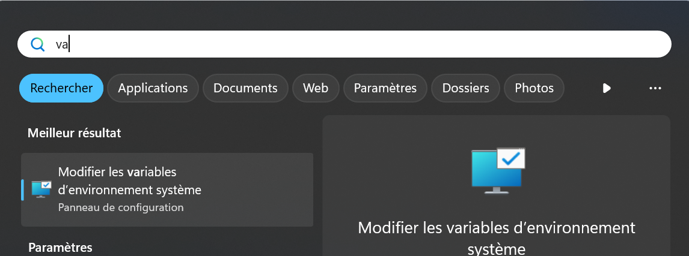
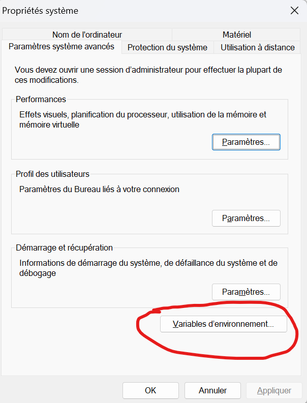
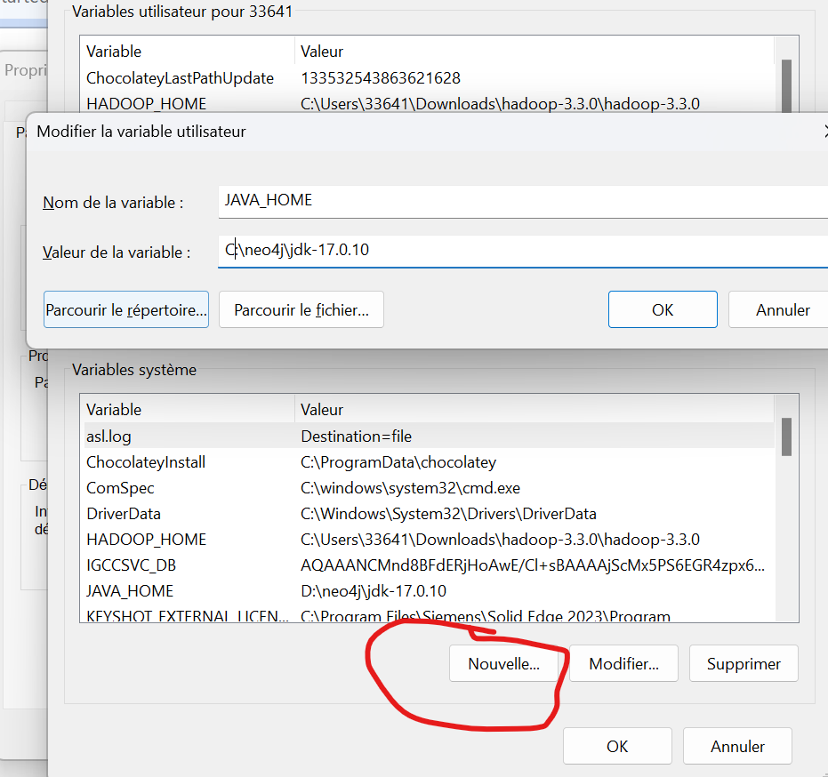
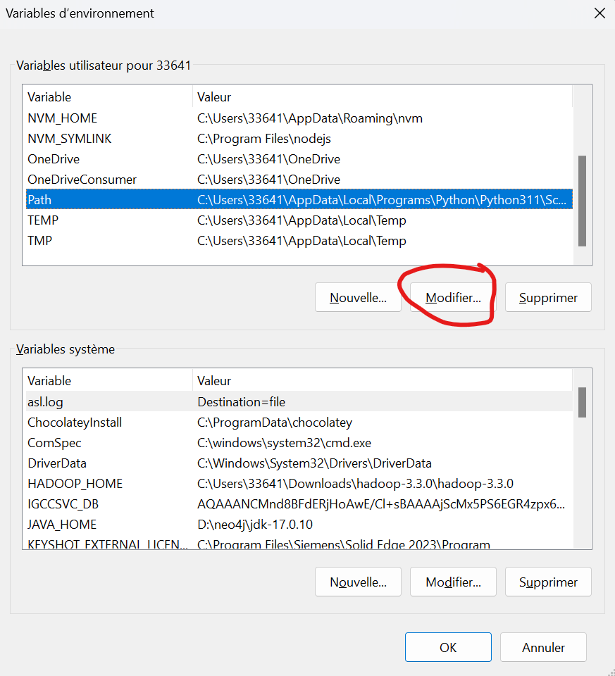
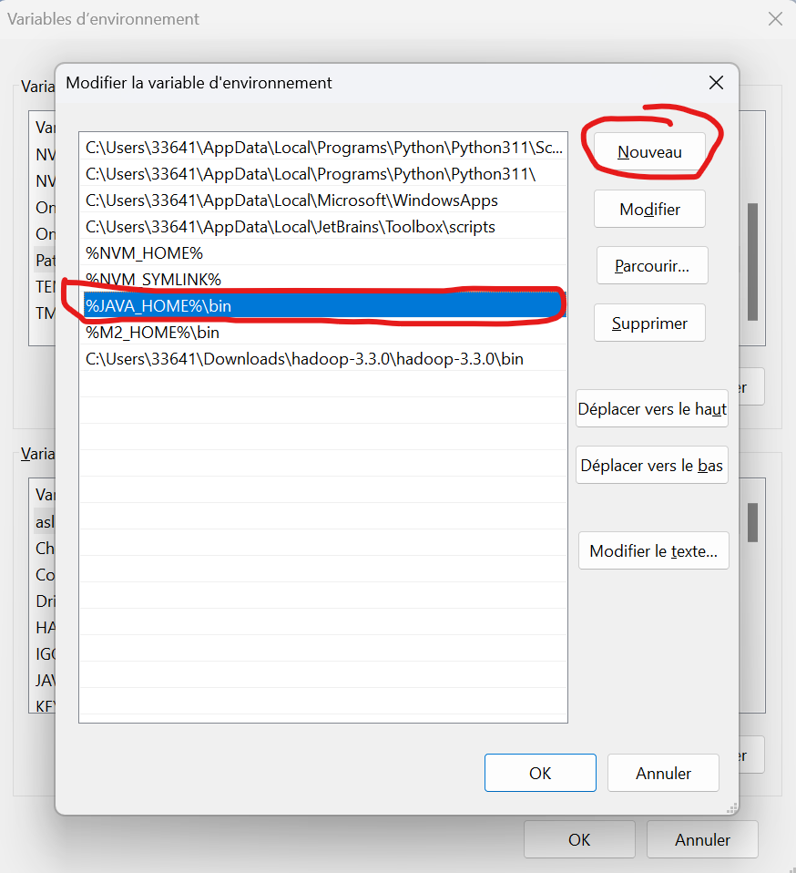
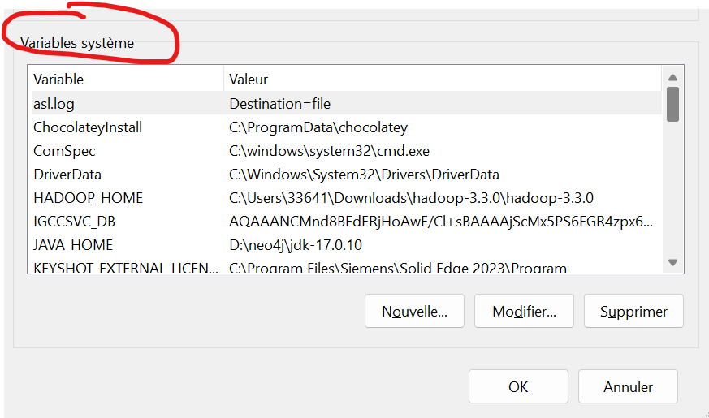
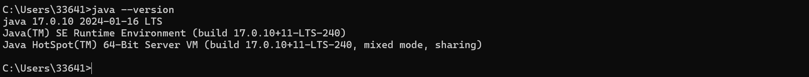
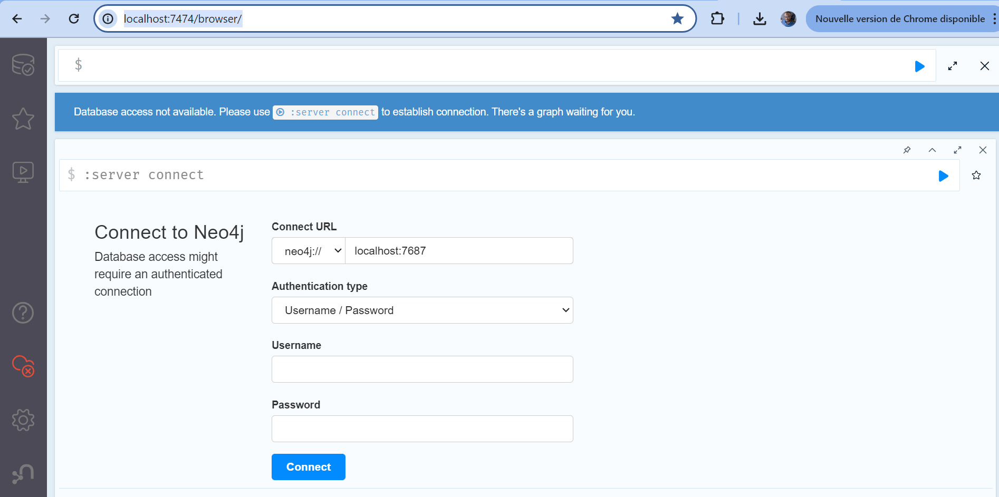

# Installation sous windows
## Prequis ##
### Note important
```
Pour installation neo4j nous avons besoin de Java
Chaque version majeure de no4j est compatible avec une version de java .
Pour ce cours nous allons installer a version 5.17 de neo4j qui requiert java 17.
```
#### Installation de Java 17
1. Creer un dosser neo4j dans C:\ ou dans un dossier de votre choix
2. Telecharger java 17 pour windows jdk-17_windows-x64_bin.zip
3.  Decompresser le zip et copier le dossier jdk-17.0.10 dans C:\neo4j\
4. Modifier les variables d'environnement windows pour pointer vers java 17
   1. Chercher variables dans la recherche windows
      
   2. Cliquer sur Modifier variables d'environnement
   3. Sur la fenetre ci-dessus cliquer sur Variables d'environnement
        
   4. Cliquer sur Nouvelle et Ajouter une nouvelle Variable JAVA_HOME comme
        
   5. Cliquer sur la variable Path puis modifier comme sur l'image
        
           
       Le Ajouter %JAVA_HOME%\bin
   6. Cliquer Ok 
   7. Faite pareil les etapes  4.1 à 1.6 pour le bloc Variables Systeme
        
8. Verifier si Java 17 est votre version de java par defaut.
   1. Ouvrir une terminale
   2. Taper java --version
    
**Bravo Vous venez d'installer java 17.**

#### Installation de NEO4J 5  
1. Telecharger   neo4j-community-5.19.0-windows.zip  ici https://neo4j.com/deployment-center/
2.  Decompresser le zip et copier le dossier neo4j-community-5.19.0 dans C:\neo4j\
3. Ouvrir une console et Aller dans C:\neo4j\neo4j-community-5.19.0\bin
4. Taper .\neo4j.bat console
5. Puis ouvrir http://localhost:7474/browser/
    
    Le user et le mot de pass par defaut est : neo4j / neo4j . 
    Il vous demandera de  changer le mot de pass
   **Bravo Vous venez d'installer votre serveur neo4j.**

