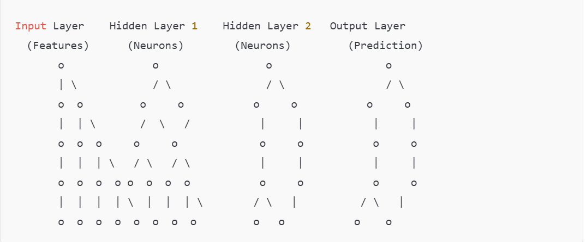
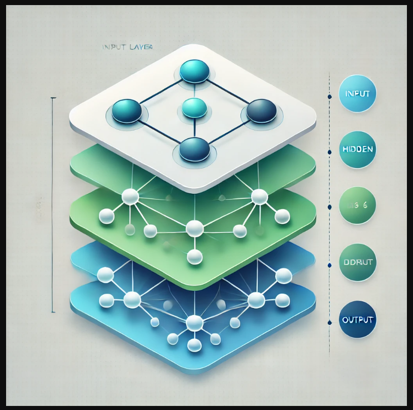

= Project : Build Neural network structure using Neo4j Graph Database

=== Neural network structure
==== Rappels
===== Graph visual  representation

===== Layer visual  representation

=== Description du projet
Le code python Neo4jGraphAsNnetwork.py construct un simple NN de 3 couches en utilisant uniquement neo4j et du code python sans les outils comme tensorflow etc..

==== Description des fonctions principales du projet

Le code qui initialise la structure du NN

[source,python]
----
def initialize_nn(self, network_structure, task_type, activation,batch_size=32):
    if task_type == "regression":
        self.db_manager.execute(self.create_network, network_structure, task_type, output_activation=activation)
    if task_type == "classification":
        self.db_manager.execute(self.create_network, network_structure, task_type, hidden_activation=activation)
    #print(f"Hyper parameters  network_structure{network_structure}, task_type: {task_type}, output activation_function: {activation}")
    start_time = time.time()  # Record the start time
    logging.info("Starting setting batch inputs/expecteds rows...")
    self.db_manager.execute(self.create_inputs_row_node, network_structure,batch_size)
    self.db_manager.execute(self.create_outputs_row_node, network_structure,batch_size)
    end_time = time.time()  # Record the end time
    duration = end_time - start_time  # Calculate the duration
    logging.info(
        f"Finished setting  batch inputs/expecteds rows.. Total time taken: {duration:.2f} seconds.")
----

Le code qui set les inputs/ouputs à partir de la dataset

[source,python]
----
def setInputs_expectedOutputs(self,dataset):
    start_time = time.time()  # Record the start time
    logging.info("Starting setting  inputs/expecteds  values and adam parameters of the network...")
    self.db_manager.execute(self.initialize_adam_parameters)
    self.db_manager.execute(self.set_inputs, dataset)
    self.db_manager.execute(self.set_expected_outputs, dataset)
    end_time = time.time()  # Record the end time
    duration = end_time - start_time  # Calculate the duration
    logging.info(f"Finished setting  input/expected values and adam parameters of the network.. Total time taken: {duration:.2f} seconds.")

----

===== Travail à faire

C'est de transformer les requetes cyphers qui sont dans toutes les methode du projet en procedure stockée.
Vous n'avez pas besoin d'exécuter  le code python pour realiser ces taches.

Guide: Afin de vous guider dans la lecture du code python :

[source,python]
----
def train(self, dataset, learning_rate, beta1, beta2, epsilon, task_type, epoch):
    total_train_loss = 0
    self.db_manager.execute(self.forward_pass)
    loss = self.db_manager.execute(self.compute_loss, task_type)
    total_train_loss += loss
    self.db_manager.execute(self.backward_pass_adam, learning_rate, beta1, beta2, epsilon, epoch)
    self.db_manager.execute(self.constrain_weights)
    # Average loss for this epoch
    avg_train_loss = total_train_loss / len(dataset)
    print(f"Epoch {epoch},Train  Loss: {loss:.4f}, Train AVG Loss: {avg_train_loss:.4f}")
    return loss, avg_train_loss

----

===== Démarches et organisation.
1. Chaque equipe projet doit creer une branche de travail à partir du repos :
    https://github.com/miyasiffaye/neo4j-cours.git
2. Implementer sur sa branch
3. Committer et push sa branch quand c'est nécessaire

===== Soutenance
1. Une presentation de 10mn
2. Qui doit ressortir l'objectif du projet
3. Les problemes rencontres et comment vous avez fait pour les resoudre
4. Ce que vous avez appris et se projecter dans le futur.
